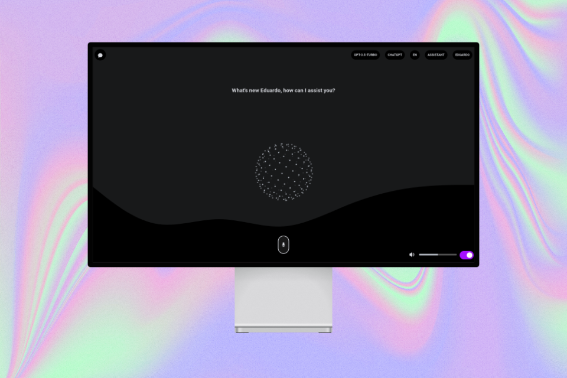
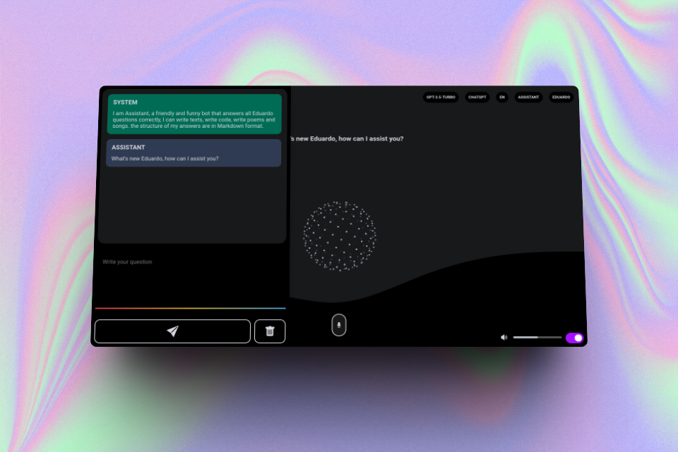
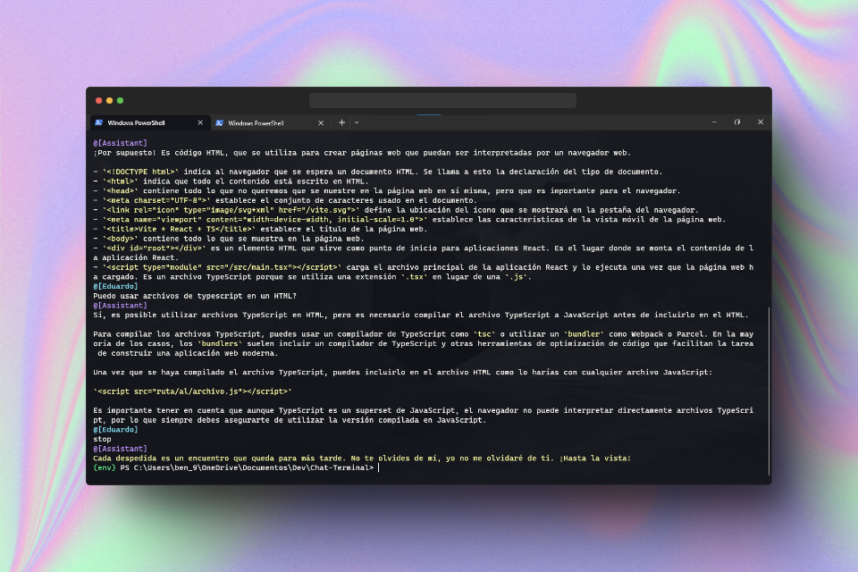
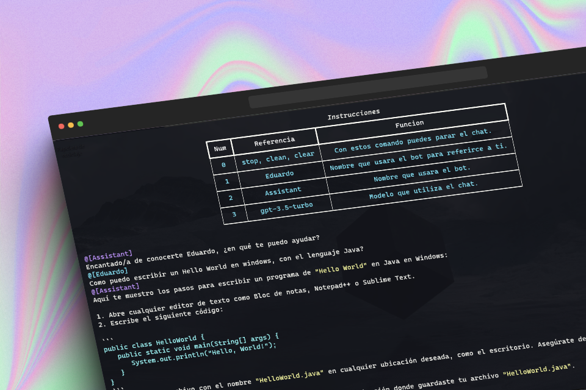

<h1 align="center">AssistAI</h1>

<p align="center" >


</p>

<p align="center">Simple chatbot from the terminal</p>

<p aling="center" >
<h2 align="center" >UI Version</h2>


<h2 align="center" >Terminal Version</h2>


</p>

This project consists of creating a chatbot that uses the OpenAI GPT-3.5-turbo language model to generate responses to user input. The chatbot runs in the terminal and communicates with the OpenAI api using the OpenAI python library.

## 😸 Why the project?

The goal of this project is to create a terminal chatbot using the ChatGPT API to provide users with a smooth and satisfying chat experience. This chatbot will allow users to interact with ChatGPT's artificial intelligence directly from the command line, without the need for a graphical user interface.

The use of Python as a programming language will allow the implementation of a simple and easy to understand terminal chatbot. The ChatGPT API will provide the artificial intelligence needed to generate accurate and consistent responses to user queries.

This project will also allow developers to improve their skills in Python and chatbot development. Furthermore, they can also use this project as a foundation to build more complex and sophisticated chatbots in the future.

In short, the main goal of this project is to provide users with an easy and accessible way to interact with ChatGPT's artificial intelligence, while also offering an opportunity for developers to improve their Python and chatbot development skills.

## Requirements

- [x] [Python>=3.7](https://www.python.org/downloads/)
- [x] [Virtualenv](https://virtualenv.pypa.io/en/latest/)
- [x] [Openai API Key](https://platform.openai.com/account/api-keys)

## Setting

The program has a series of settings that allow the model to behave in one way or another. These are found in the [settings.py](./settings.py) script.

| VARIABLE         | TYPE         | FUNCTION                                                                                                                                          |
| ---------------- | ------------ | ------------------------------------------------------------------------------------------------------------------------------------------------- |
| NAME_BOT         | STRING       | Indicates the name that the bot will use                                                                                                          |
| NAME_USER        | STRING       | Indicates the username, this value is normally prompted during code execution, but can be omitted and assigned directly in the variable           |
| KEYS             | LIST[STRING] | Indicates the special phrases that execute some action in the chat                                                                                |
| COLOR_TEXT       | BOOLEAN      | Indicates if you want to color the text returned by the bot                                                                                       |
| TYPING_EFFECT    | BOOLEAN      | Indicates if you want to have a typing effect on the bot's response                                                                               |
| VIEW_NEW_INPUT   | BOOLEAN      | Indicates if you want to see what the final input that will be sent to the bot is like                                                            |
| VIEW_INSTRUCCION | BOOLEAN      | Indicates if you want to show the instructions                                                                                                    |
| VIEW_CONTEXT     | BOOLEAN      | Indicates if the context that is sent to the bot when starting the conversation will be displayed                                                 |
| IA               | STRING       | Indicates the AI that will be used                                                                                                                |
| MODEL            | STRING       | Indicates the model that the AI will use                                                                                                          |
| CONTEXT          | STRING       | It indicates the context that the bot will use to start the conversation and its behavior as well as understanding its name and that of the user. |
| WELCOME_MESSAGES | LIST[STRING] | This is a list of welcome messages when starting the conversation                                                                                 |
| GOODBYE_MESSAGES | LIST[STRING] | This is a list of farewell messages that will be displayed at the end of the conversation                                                         |
| OPTIONS_HEADER   | LIST[STRING] | These are the names that the instruction table uses as headers                                                                                    |
| OPTIONS_BODY     | LIST[STRING] | This list represents the contents of the instruction table                                                                                        |
| VOICE            | BOOLEAN      | This variable indicates whether a voice will be played with the text returned by the bot.                                                         |
| API_KEY          | STRING       | This variable indicates the apikey to be used by the models that need it.                                                                         |

## Features

### Current characteristics

- [x] Compatibility with several languages Spanish, English, Japanese and French.
- [x] Compatible with the openai API which allows to integrate the available GPT models.
- [x] Coloring of the code and text that the chatbot returns.
- [x] Ability to use the content of files (especially code) to complement the input.
- [x] You can play an audio with the bot's response.

### Future features

At the moment there is no fixed time objective or goal to add new features but over time I hope to increase the functions of the program.

- [ ] Compatibility with more languages and in a better way.
- [ ] Use of other AI models such as LlaMa, Bard, OpenAssitant, etc.
- [ ] Possibility of extracting the content of different files such as Word and Pdf.
- [ ] Possibility to extract audio text with Whisper and integrate to propmt.
- [ ] Ability to insert images at the prompt as indicated by the GPT-4 api.
- [ ] Ability to generate script based on the generated code.
- [ ] Ability to fully function locally with AI models that allow it.

## How to use

The first thing is to clone this repository to your local device and enter the project folder with the following commands.

```bash
git clone https://github.com/EddyBel/Chat-Terminal.git

cd Chat-Terminal
```

Create a new virtual environment with python virtualenv, for this example the virtual environment will be named "env", but you can call it whatever you like.

```bash
python -m venv env
```

Activate the virtual environment with the following command according to your device.

### Windows

```bash
 .\env\Scripts\activate
```

### Linux

```bash
source env/bin/activate
```

Install all the python packages that are required for it to run correctly.

```bash
pip install -r requirements.txt
```

Once all the necessary modules have been installed, you can proceed to run the program with the following command, and that's it!

```bash
python main.py
```

## Licence

<h3 align="center">MIT</h3>

---

<p align="center">
  <a href="https://github.com/EddyBel" target="_blank">
    
  </a>
  <a href="https://www.linkedin.com/in/eduardo-rangel-eddybel/" target="_blank">
    
  </a>
</p>
