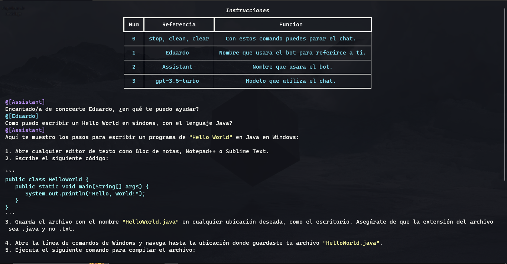
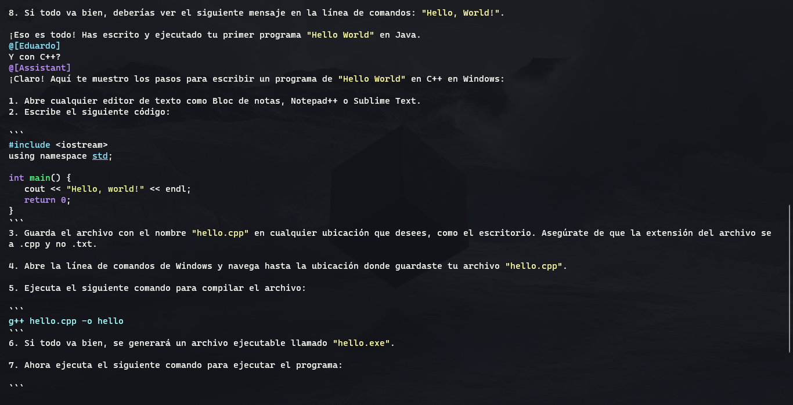
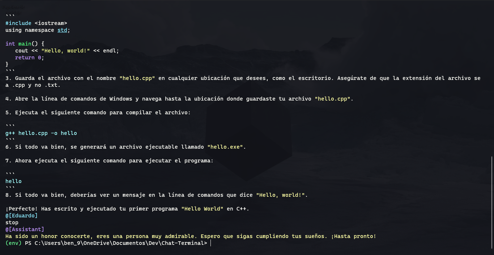
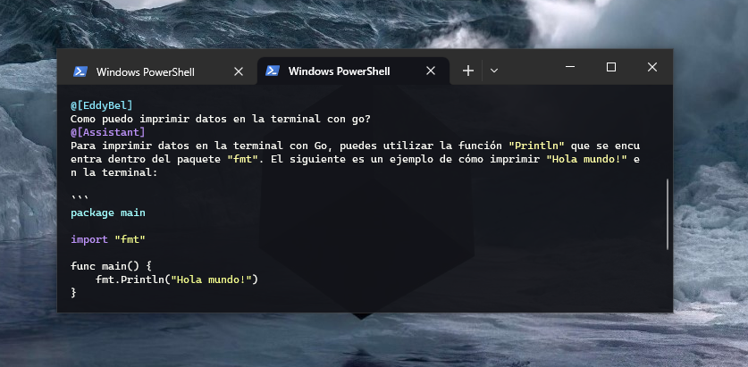

<h1 align="center">Chat Terminal</h1>


---

Este proyecto consiste en crear un chatbot que utiliza el modelo de lenguaje GPT-3.5-turbo de OpenAI para generar respuestas a las entradas del usuario. El chatbot se ejecuta en la terminal y se comunica con la api de OpenAI mediante la librería de python de OpenAI.

## Proyecto






## ¿Por que del proyecto?

El objetivo de este proyecto es crear un chatbot de terminal utilizando la API de ChatGPT para proporcionar a los usuarios una experiencia de conversación fluida y satisfactoria. Este chatbot permitirá a los usuarios interactuar con la inteligencia artificial de ChatGPT directamente desde la línea de comandos, sin la necesidad de utilizar una interfaz gráfica de usuario.

El uso de Python como lenguaje de programación permitirá la implementación de un chatbot de terminal simple y fácil de entender. La API de ChatGPT proporcionará la inteligencia artificial necesaria para generar respuestas precisas y coherentes a las consultas de los usuarios.

Este proyecto también permitirá a los desarrolladores mejorar sus habilidades en Python y en el desarrollo de chatbots. Además, también pueden usar este proyecto como base para construir chatbots más complejos y sofisticados en el futuro.

En resumen, el objetivo principal de este proyecto es proporcionar a los usuarios una forma fácil y accesible de interactuar con la inteligencia artificial de ChatGPT, al mismo tiempo que ofrece una oportunidad para que los desarrolladores mejoren sus habilidades en Python y en el desarrollo de chatbots.

## Pasos para la ejecución

Descarga o clona el repositorio del proyecto con la siguiente instrucción.

```bash
git clone https://github.com/EddyBel/Chat-Terminal.git
```

Abre una terminal en la ubicación del repositorio descargado.

```bash
cd Chat-Terminal
```

Crea un nuevo entorno virtual de Python utilizando virtualenv. Si aún no tienes virtualenv instalado, primero debes instalarlo usando el siguiente comando:

```bash
pip install virtualenv
```

Luego, puedes crear el entorno virtual utilizando el siguiente comando:

```bash
python -m venv env
```

Activa el entorno virtual utilizando el siguiente comando:

> #### Windows
>
> ```bash
> .\env\Scripts\activate
> ```

> #### Linux
>
> ```bash
> source env/bin/activate
> ```

Ahora, instala los módulos necesarios para el proyecto utilizando el archivo requirements.txt. Para hacer esto, ejecuta el siguiente comando:

```bash
pip install -r requirements.txt
```

Una vez que se hayan instalado todos los módulos necesarios, puedes ejecutar el archivo principal del proyecto utilizando el siguiente comando:

```bash
python main.py
```

¡Eso es todo! El chatbot de terminal utilizando la API de ChatGPT ahora debería estar funcionando correctamente. Ahora puedes probarlo haciendo algunas preguntas en la terminal y viendo las respuestas generadas por el bot.

> ### Nota
>
> Para usar el chatbot es necesario que tenga un token de openai, a la hora de ejecutar el chatbot este le
> pedira el token, una vez ingresandolo listo puede preguntar sin problemas a chatgpt.

## Tecnologias utilizadas

- Python
- ChatGPT
